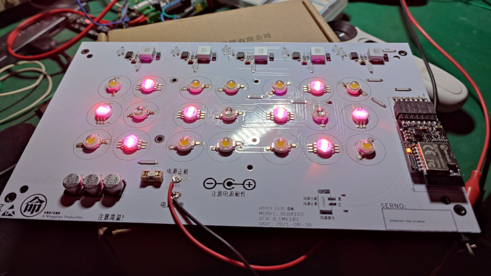
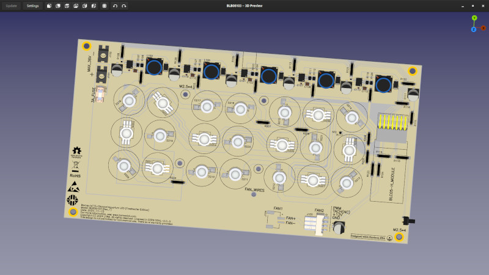

# A Based Open Source WiFi Aquarium LED DIY Kit

English | [中文](README.zh.md)

---

Borneo-IoT project is a commercial-grade, highly customizable open-source smart WiFi aquarium LED PWM controller module and mobile App. 
More than that, this project also includes a 63W 5-color channel LED product as reference design. 

For more information, please visit the project's website: [www.borneoiot.com](https://www.borneoiot.com).
Hardware datasheets in English and Chinese are available in this repo: [hw/datasheets](hw/datasheets)

If you like this project, please don't forget to give it a star. Thank you!

## Features

- **Full Stack Open Source**
    - Schematic and PCB Layout design source files for the WiFi LED controller module (core board) using [Horizon EDA](https://horizon-eda.org)
    - Schematic and PCB Layout design source files for a 5-channel 63W lamp reference design using Horizon EDA
    - Fully firmware source code based on the [ESP-IDF framework](https://idf.espressif.com/)
    - Full source code for the mobile app developed using Flutter
- **Highly Customizable Modular Design**
    - The core board of the controller module is only 2cm x 3.5cm in size, making it easy to integrate
    - If using the core board is inconvenient, you can refer to the schematic to integrate the microcontroller and peripheral circuits into a custom PCB
- **Component-based firmware architecture**
    - Independent board definitions, supporting different families of Espressif microcontrollers without code modifications, compatible with ESP32/ESP32-C3/ESP32-C5 and more;
    - The firmware architecture uses a driver and initialization management framework similar to Zephyr RTOS, separating the underlying layer from application functionality
    - Universal CoAP + CBOR underlying protocol, allowing the mobile app to support various devices such as lamps, dosing pumps, and thermometers;
- **Feature-rich**
    - A standalone 5-channel PWM LED controller operable via a mobile app, requiring almost zero peripheral components
    - Autonomous multi-stage sunrise/sunset graphical dimming and soft start for the module, with an easy setup mode
    - Automatic time synchronization based on the SNTP protocol
    - PID-based automatic cooling fan control and other protection features
    - Python client library and demo scripts for module communication
    - Optional peripheral INA139 current monitoring
- **Budget-friendly**
    - The MCU uses the popular low-cost ESP32-C3 (5-channel version) or ESP32 (10-channel version), with no any custom components
    - Built-in voltage regulation circuit can directly drive the cheapest two-wire cooling fans, and also supports PWM speed-controlled fans
    - The module uses pin headers by default, making it convenient for DIY enthusiasts
- **Ready for Mass Production**[^1]
    - Devices support wireless OTA firmware updates directly from the server
    - Provides GUI-based mass production tools and software:
        - Automatic firmware burning
        - Automatic QA testing
        - Automatic setting of product name, model, serial number, PID parameters, initial parameters, etc., based on the overall product
- **Field-proven**
    - The prototype of this controller and LED driver has been running stably on my own planted tank for years

And much more, such as a dosing pump and pH monitor currently under development based on this firmware and app architecture.

[^1]: The open-source project does not provide mass production-related fixtures and software.

## Demo Pictures & Videos

- Youtube: TODO

https://github.com/user-attachments/assets/08cb37ea-8b35-413a-9ee4-c4d95e3cb3bf

|    LED Controller Module Appearance |    LED LED Controller Module Schematic |
|------------------------------------------|------------------------------------------ |
|    LED Controller - Old Prototype |    Aluminum PCB - Old Prototype |
|    Aluminum PCB Appearance |    Reference Design Lamp Appearance[^2] |

[^2]: The enclosure was manually measured and modeled by me after purchasing it from a friend, therefore, I regret that the design cannot be made public. If there is significant interest, I can redesign it.

## Project Status

### Hardware & Firmware

**Beta**：The firmware is full functionality and stability, but some minor features are still not quite perfect.

### Mobile App

**Pre-Beta**：All major functions have been completed and are operational, but minor functions such as setting the time zone still need to be implemented, and the stability also requires further polishing.

## Roadmap

Checkout the [milestones](https://github.com/oldrev/borneo/milestones) to get a glimpse of the upcoming features and milestones.

## Directory Structure

- `client/`: Mobile app source code
- `fw/`: Firmware source code
    - `scripts`: Related Python scripts, including the device Python client library
    - `cmake`: CMake scripts
    - `components`: Common ESP-IDF component source code
    - `lyfi`: LED controller firmware-related source code
    - `doser`: Dosing pump firmware-related source code (under development)
- `hw/`: Circuit design source files
    - `blc05mk3`: 5-channel LED controller core board design
    - `blc05mk3-horizontal`: 5-channel LED controller core board with horizontal pin headers
    - `blb08103`: 5-channel 63W LED lamp aluminum substrate design
    - `3d-models`: Exported STEP format 3D models of the core board
    - `datasheets`: The hardware specifications in PDF format[^3]
- `tools/`: Related scripts and tools

[^3]: Since the datasheets are based on templates from my other products, the source file will not be provided in this repository.

## Getting Started

Please check out the [online documentation](https://docs.borneoiot.com/getting-started).

## Contribution

Please read [CONTRIBUTING.md](.github/CONTRIBUTING.md) for more details.

If you want to support the development of this project, you could consider buying me a beer.

## Issues, Feedback & Support

We welcome your feedback! If you encounter any issues or have suggestions, please open an [issue](https://github.com/oldrev/borneo/issues).

- Website：[www.borneoiot.com](https://www.borneoiot.com)
- Online documentation：[docs.borneoiot.com](https://docs.borneoiot.com)
- GutHub Discussions: [github.com/oldrev/borneo/discussions](https://github.com/oldrev/borneo/discussions)
- Author's e-mail: [oldrev@gmail.com](mailto:oldrev@gmail.com)
- Borneo-IoT Discord Server: [https://discord.gg/25mK6KAc](https://discord.gg/25mK6KAc)

## License

### Software & Firmware

The software and firmware in this project is dual-licensed under the GNU General Public License version 3 (GPL-3.0-only) and a commercial license. You can find the full text of the GPL-3.0-only license in the [LICENSE](LICENSE) file.

### Hardware

The hardware design in this project is licensed under the CERN Open Hardware Licence Version 2 - Strongly Reciprocal (CERN-OHL-S-2.0). You can find the full text of the license in the [LICENSE-HARDWARE](LICENSE-HARDWARE) file.

#### Proprietary Licensing

In addition to the GPL-3.0-only license, I also offer proprietary licensing options for those who wish to use this software in proprietary products.

If you are interested in obtaining a proprietary license, please contact me at [oldrev@gmail.com](mailto:oldrev@gmail.com).

